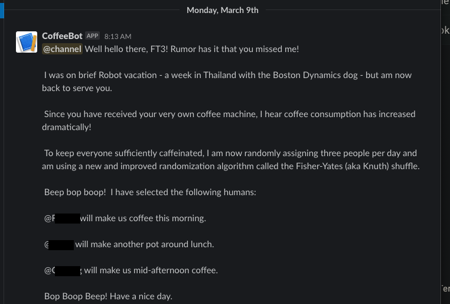

Ever been frustrated with figuring out whose turn it is to make coffee? CoffeBot is here to help!

Using google sheets, google app scripting, and a custom Slack application, I've devised an automated robot to assign office colleagues with the task of making coffee. CoffeeBot sends a daily message to our team 's Slack channel around 0830 on the weekdays.

Inspired by https://drakecooper.com/built-office-bot-assign-chores-2/.
